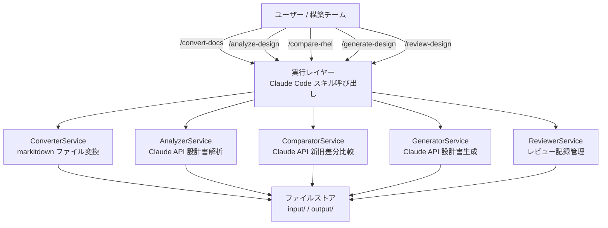
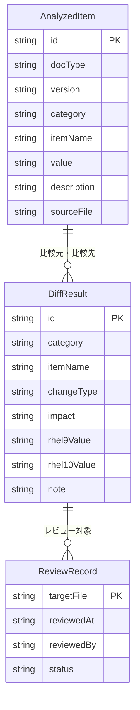
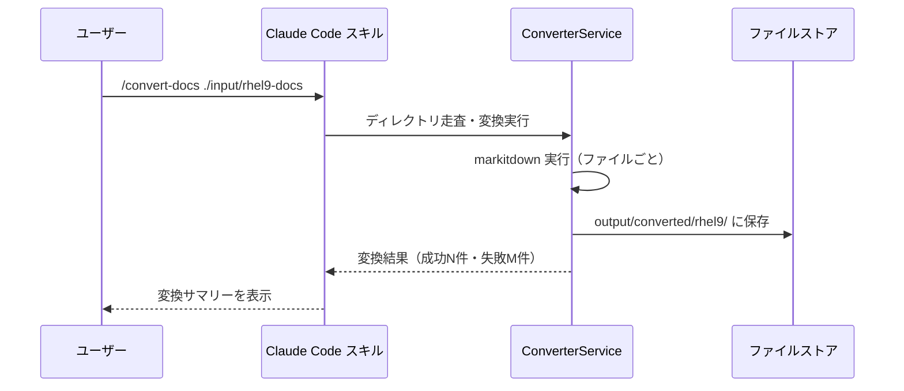
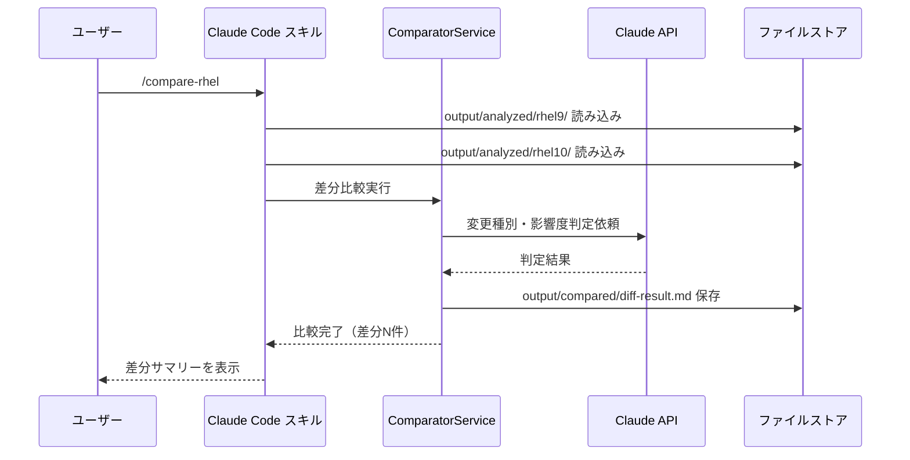

# 機能設計書 (Functional Design Document)

## システム構成図



## 技術スタック

| 分類 | 技術 | 選定理由 |
|------|------|----------|
| 実行基盤 | Claude Code スキル（Markdown） | コーディング不要・即時利用可能 |
| ファイル変換 | markitdown（Python CLI） | .doc/.pdf/.pptx/.xlsx → Markdown 変換の実績あり |
| AI 解析・生成 | Claude API（Anthropic） | 日本語設計書の高精度解析・生成 |
| インターフェース | Claude Code CLI | ターミナルから `/コマンド` 形式で呼び出し |
| データ保存 | ローカルファイルシステム（Markdown） | シンプル・バージョン管理可能 |

---

## データモデル定義

### エンティティ: AnalyzedItem（解析済み設定項目）

```typescript
interface AnalyzedItem {
  id: string;            // 連番または UUID
  docType: DocType;      // 設計書種別
  version: 'rhel9' | 'rhel10';  // 対象 RHEL バージョン
  category: string;      // 設定カテゴリ（例: ネットワーク、セキュリティ）
  itemName: string;      // 設定項目名
  value: string;         // 設定値
  description: string;   // 説明
  sourceFile: string;    // 元ファイルパス
}

type DocType = 'standard' | 'basic' | 'detail' | 'test';
```

### エンティティ: DiffResult（差分比較結果）

```typescript
interface DiffResult {
  id: string;
  category: string;
  itemName: string;
  changeType: 'changed' | 'added' | 'deleted' | 'unchanged';
  impact: 'high' | 'medium' | 'low';
  rhel9Value: string | null;
  rhel10Value: string | null;
  note: string;
}
```

### エンティティ: ReviewRecord（レビュー記録）

```typescript
interface ReviewRecord {
  targetFile: string;    // レビュー対象ファイルパス
  reviewedAt: string;    // レビュー日時（ISO 8601）
  reviewedBy: string;    // レビュアー名
  status: 'approved' | 'needs-fix' | 'pending';
  comments: ReviewComment[];
}

interface ReviewComment {
  line: number | null;
  comment: string;
}
```

### ER図



---

## コンポーネント設計

### ConverterService（設計書変換）

**責務**:
- 指定ディレクトリ内の対象ファイルを markitdown で Markdown に変換
- .md/.yml/.yaml はスキップ（変換不要）
- 変換結果を `output/converted/` に保存

**処理フロー**:
```
入力ディレクトリ走査
→ 拡張子判定（変換対象 / スキップ）
→ markitdown 実行
→ output/converted/{version}/ に保存
→ 変換サマリー（成功数・失敗数・スキップ数）を表示
```

**エラー処理**:
- markitdown 未インストール → インストール手順を表示して終了
- 個別ファイル変換失敗 → スキップして次のファイルへ（部分失敗許容）

---

### AnalyzerService（設計書解析）

**責務**:
- 変換済み Markdown 設計書を Claude API で解析
- 設定項目・値・説明を構造化して抽出
- 解析結果を `output/analyzed/{version}/` に保存

**処理フロー**:
```
対象ファイル読み込み
→ Claude API にプロンプト送信（設定項目抽出指示）
→ 構造化 Markdown（表形式）で結果受信
→ output/analyzed/{version}/{docType}.md に保存
→ 解析サマリー表示
```

**プロンプト設計方針**:
- 設定項目名・設定値・説明の3カラムで抽出
- カテゴリ単位でグループ化
- 解析できなかった箇所は「要確認」としてマーク

---

### ComparatorService（差分比較）

**責務**:
- RHEL9 と RHEL10 の解析結果を突合
- 変更種別（changed/added/deleted/unchanged）と影響度を判定
- 差分結果を `output/compared/` に保存

**処理フロー**:
```
rhel9 解析結果 + rhel10 解析結果を読み込み
→ 項目名でマッチング
→ 変更種別・影響度を Claude API で判定
→ 差分一覧表（Markdown テーブル）を生成
→ output/compared/diff-result.md に保存
```

**影響度判定基準**:
- 高: セキュリティ・ネットワーク・認証に関わる変更
- 中: サービス起動・パッケージ管理・設定ファイルパスの変更
- 低: ドキュメント記載のみ・推奨値の変更

---

### GeneratorService（設計書生成）

**責務**:
- 差分比較結果と旧設計書をもとに RHEL10 対応設計書ドラフトを生成
- 変更箇所に `<!-- AI生成: 要レビュー -->` マーカーを付与
- 生成結果を `output/generated/` に保存

**処理フロー**:
```
旧設計書（Markdown）+ 差分比較結果を読み込み
→ Claude API にドラフト生成指示を送信
→ 生成ドラフト受信（変更箇所マーカー付き）
→ output/generated/{docType}-rhel10-draft.md に保存
→ 生成サマリー（変更反映箇所数）を表示
```

---

### ReviewerService（レビュー記録）

**責務**:
- AI 生成物にレビューコメントと承認ステータスを付与
- レビュー結果を `output/reviewed/` に保存
- 未承認の成果物を次スキルで使用しようとした場合に警告

**処理フロー**:
```
レビュー対象ファイル指定
→ ファイル内容を表示
→ ユーザーからコメント・ステータス入力
→ output/reviewed/{filename}-review.md に保存
```

---

## ユースケース図

### UC1: 設計書変換フロー



### UC2: 差分比較フロー



---

## ファイル構造

```
project-root/
├── input/
│   ├── rhel9-docs/        # 旧バージョン設計書（.doc/.pdf/.xlsx 等）
│   └── rhel10-docs/       # 新バージョン設計書（.doc/.pdf/.xlsx 等）
├── output/
│   ├── converted/
│   │   ├── rhel9/         # 変換済み Markdown（RHEL9）
│   │   └── rhel10/        # 変換済み Markdown（RHEL10）
│   ├── analyzed/
│   │   ├── rhel9/         # 解析済み構造化データ（RHEL9）
│   │   └── rhel10/        # 解析済み構造化データ（RHEL10）
│   ├── compared/
│   │   └── diff-result.md # 差分比較結果
│   ├── generated/
│   │   └── *-rhel10-draft.md  # 生成ドラフト
│   └── reviewed/
│       └── *-review.md    # レビュー記録
└── .claude/
    └── skills/            # Claude Code スキル定義
```

**解析結果ファイル例** (`output/analyzed/rhel9/standard.md`):

```markdown
## カテゴリ: ネットワーク設定

| 設定項目 | 設定値 | 説明 |
|---------|--------|------|
| NetworkManager | enabled | ネットワーク管理サービス |
| firewalld | enabled | ファイアウォール管理 |
```

---

## エラーハンドリング

### エラーの分類

| エラー種別 | 処理 | ユーザーへの表示 |
|-----------|------|-----------------|
| markitdown 未インストール | 処理中断 | `pip install markitdown` の実行を案内 |
| ファイル変換失敗 | 該当ファイルをスキップ | `[SKIP] filename.xlsx: 変換に失敗しました` |
| 解析対象ファイルなし | 処理中断 | `output/converted/{version}/ が存在しません。先に /convert-docs を実行してください` |
| Claude API エラー | リトライ1回後に中断 | `AI解析に失敗しました。APIキーと接続を確認してください` |
| 差分比較の前提データなし | 処理中断 | `RHEL9/RHEL10 両方の解析結果が必要です` |

---

## パフォーマンス最適化

- **バッチ処理**: ファイル変換・解析は1ファイルずつ逐次処理し、失敗時も他ファイルへの影響を最小化
- **キャッシュ活用**: 同一ファイルの再変換・再解析時は既存出力ファイルが存在すれば確認プロンプトを表示
- **プロンプト最適化**: 解析プロンプトはファイルサイズに応じて分割送信（10,000トークン超の場合）

---

## セキュリティ考慮事項

- **API キー管理**: 環境変数 `ANTHROPIC_API_KEY` から読み込み、ソースコードへのハードコード禁止
- **設計書の外部送信**: Claude API への送信前にユーザーへ確認メッセージを表示
- **ローカル処理優先**: ファイル変換（markitdown）はローカル完結、外部ストレージへの送信なし

---

## テスト戦略

### スキル動作テスト
- 各スキル（/convert-docs / /analyze-design / /compare-rhel / /generate-design / /review-design）の正常系・異常系の手動確認
- サンプル設計書（.docx / .pdf）を用いた変換・解析の E2E テスト

### 境界値テスト
- 空ディレクトリを指定した場合の動作確認
- 対応外拡張子のみが存在するディレクトリの変換動作
- Claude API がタイムアウトした場合のリトライ動作

### 回帰テスト
- 差分比較結果の変更種別・影響度の判定精度を既知サンプルで確認
